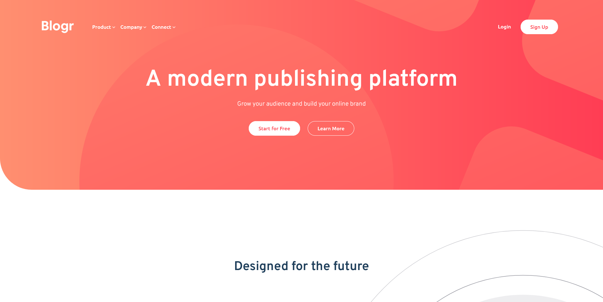
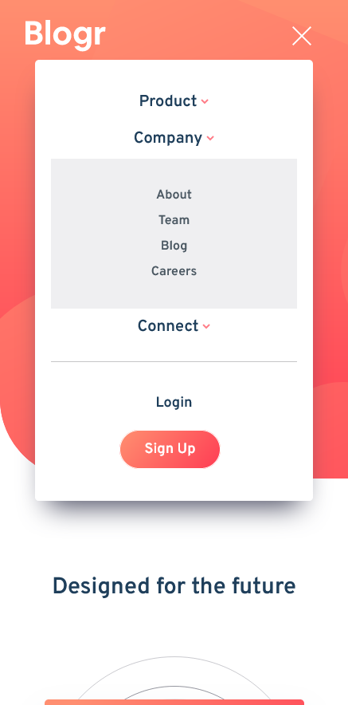

# Frontend Mentor - Blogr landing page solution

This is a solution to the [Blogr landing page challenge on Frontend Mentor](https://www.frontendmentor.io/challenges/blogr-landing-page-EX2RLAApP). Frontend Mentor challenges help you improve your coding skills by building realistic projects. 

## Table of contents

- [Overview](#overview)
  - [The challenge](#the-challenge)
  - [Screenshot](#screenshot)
  - [Links](#links)
- [My process](#my-process)
  - [Built with](#built-with)
  - [What I learned](#what-i-learned)
- [Author](#author)

## Overview

### The challenge

Users should be able to:

- View the optimal layout for the site depending on their device's screen size
- See hover states for all interactive elements on the page

### Screenshot

### Links

- Solution URL: [solution URL here](https://www.frontendmentor.io/solutions/responsive-blogr-landing-page-gGmUNPNRd)
- Live Site URL: [live site URL here](https://blogr-landing-page-90d.pages.dev/)

## My process

I started by applying all of the Bootstrap v5 CDNs. Then I created a mobile version of the website and then adapted it to the desktop to look stunning.

### Built with

- Semantic HTML5 markup
- CSS custom properties
- Bootstrap
- Mobile-first workflow
- [Bootstrap](https://getbootstrap.com/) - Bootstrap

### What I learned

The hardest part for me was applaying bacground img on gradient, then sizing and spacing it. I have also get some experience with styling Bootstrap dropdowns and using media queries for responsive layout.

## Author

- Frontend Mentor - [@SzymonKap](https://www.frontendmentor.io/profile/SzymonKap)

